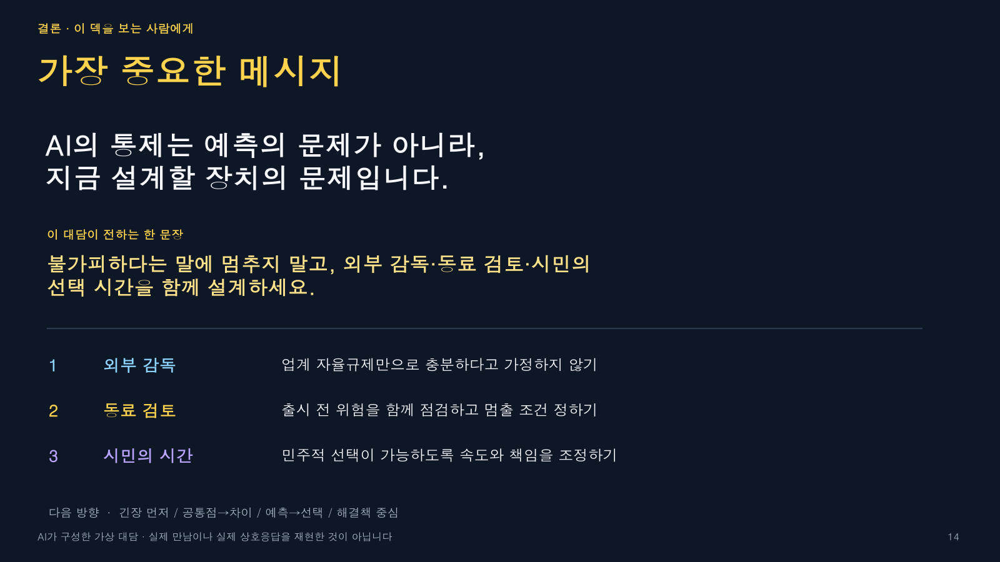

# Grounded Roundtable

**Turn 2+ YouTube interviews into a source-grounded virtual roundtable where every important claim can play back from its real timestamp.**

[한국어 README](README.ko.md) · [Live Google Slides example](https://docs.google.com/presentation/d/1zP8h6n0cUX9D8Ui6xQOocPRvUoshRaIpijkeYpF8jNY/edit?usp=sharing)


Humans are not good at watching several long interviews, remembering every argument, and comparing them across time. Grounded Roundtable is a skill for Codex, Claude Code, and compatible agents that turns those separate recordings into a thinking tool:

- a clearly disclosed **virtual** conversation, never a fake historical meeting;
- natural Korean dialogue built from source-bounded paraphrases;
- native YouTube players in Google Slides, with exact start/end ranges;
- timestamp links, channel attribution, and caption status beside every player;
- one evidence slide per exact clip, with duplicate-player and overlap checks;
- a final takeaway written for the intended audience.

## See the result first

The sample deck connects interviews with Bill Gates, Yuval Noah Harari, and Elon Musk around one question: *When AI becomes more capable than its institutions, how do humans keep agency?*

[Open the native Google Slides deck](https://docs.google.com/presentation/d/1zP8h6n0cUX9D8Ui6xQOocPRvUoshRaIpijkeYpF8jNY/edit?usp=sharing)



## Install

### Codex

```bash
git clone https://github.com/smartkwang/grounded-roundtable.git ~/.codex/skills/grounded-roundtable
```

### Claude Code

```bash
git clone https://github.com/smartkwang/grounded-roundtable.git ~/.claude/skills/grounded-roundtable
```

Restart or open a new agent session after installation. If your environment uses a different skills directory, clone this repository there without changing its internal structure.

## Use

Give the agent at least two YouTube URLs. You can also specify the discussion direction, intended audience, and takeaway.

```text
Use grounded-roundtable with these three YouTube videos:
- https://youtu.be/...
- https://youtu.be/...
- https://youtu.be/...

Direction: tension-first
Audience: teachers and organization leaders adopting AI
Create a native Google Slides deck in Korean.
```

Available directions:

- `tension-first`
- `common-ground-first`
- `forecast-to-choice`
- `solutions-first`

## How it stays grounded

The skill builds an evidence manifest before writing the conversation. Every participant claim points to one or more anchors containing the speaker, video ID, timestamp range, transcript span, and confidence status.

The render plan adds a second invariant: an exact `video_id + start + end` clip normally appears on one evidence slide only. A later dialogue turn may continue the idea, but it must not create a duplicate player.

```bash
node scripts/validate_manifest.mjs examples/manifest.json
node scripts/validate_native_structure.mjs presentation.json --evidence-slides=p4,p5,p6
```

## Cost-aware by design

The workflow retrieves each transcript once, caches it, builds a compact evidence map, and spends generation tokens only on selected scenes. When the budget is tight, it reduces topics, scenes, turns, and decoration before reducing source verification.

## Important limitations

- The conversation is AI-constructed. Participants did not hear or answer one another.
- Automatic captions are useful for locating evidence, but direct quotations still require original-audio review.
- Generated paraphrases must preserve the source's uncertainty, conditions, and scope.
- Native YouTube playback depends on the video's availability and Google Slides permissions.
- Do not use the output to falsely imply endorsement, agreement, or an actual meeting.

## Repository structure

```text
SKILL.md
references/
  dialogue-rules.md
  korean-naturalness.md
  slides-structure.md
  source-contract.md
  cost-budget.md
scripts/
  validate_manifest.mjs
  validate_native_structure.mjs
examples/
  manifest.json
```

## Contributing

Issues and pull requests are welcome, especially for new discussion directions, language-naturalness rules, evidence validators, and reusable slide themes. See [CONTRIBUTING.md](CONTRIBUTING.md).

## License

MIT

